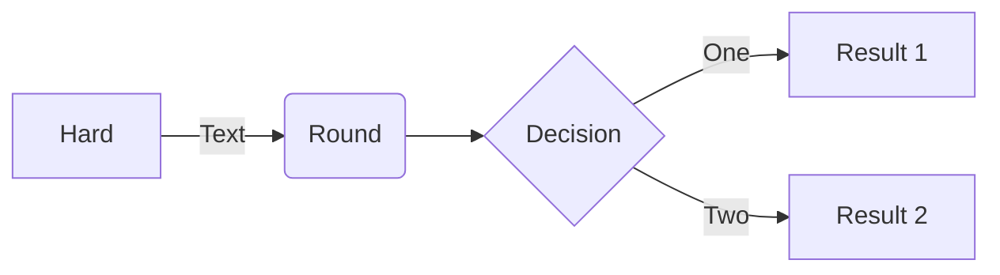

# -021
sqldb
SELECT COUNT(*) AS TABLE_COUNT - Показывает сколько таблиц

SELECT TABLE_NAME FROM INFORMATION_SCHEMA.TABLES WHERE TABLE_TYPE='BASE TABLE' - Название всех таблиц

SELECT * FROM users; Показывает пользователей

SELECT * FROM grades; Показыает все оценки

SEKECT * FROM users,grades WHERE users.user_id=grades.user_id -Кто получил оценки
$$\overline{E}_1^2=\sqrt\frac{Fa^{x-1}}{(x-1)\cdot x}+\alpha_1{}^{\frac{1}{2}}{}+\beta_2^{\frac{2}{3}}$$
$$\cos^{2}x+\sin^{2}x=1\$$
$$f^\prime(c)=\frac{f(b)-f(a)}{b-a}$$

